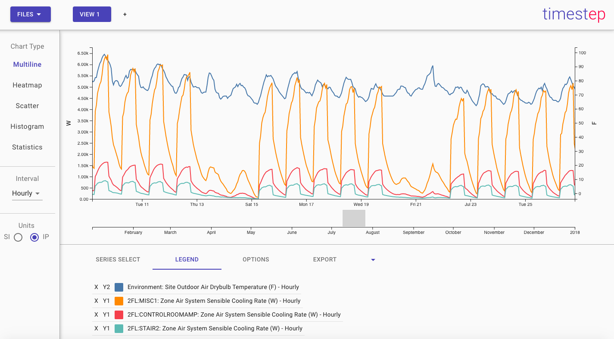
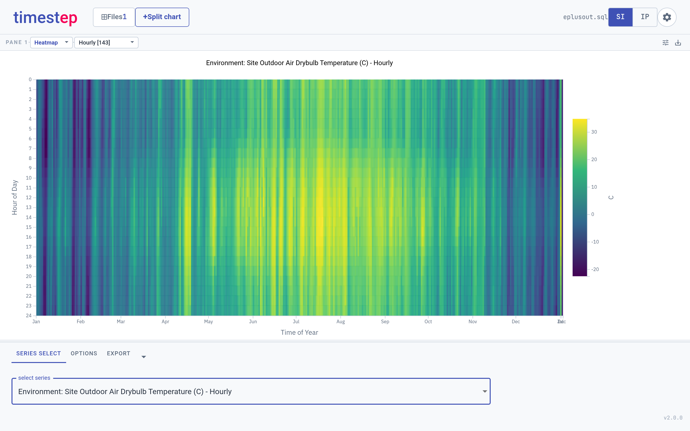
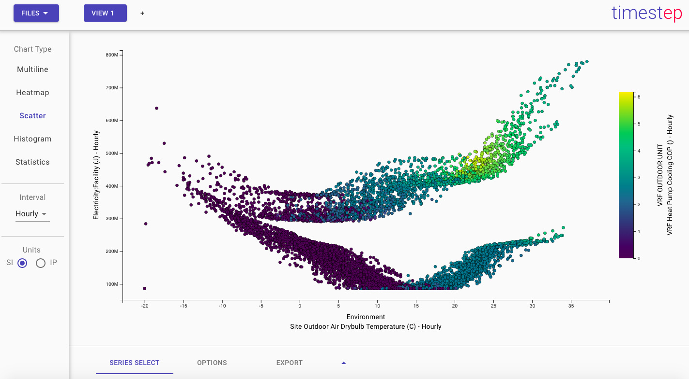
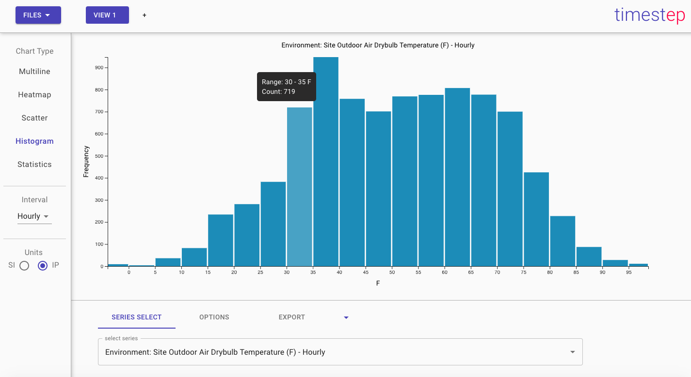
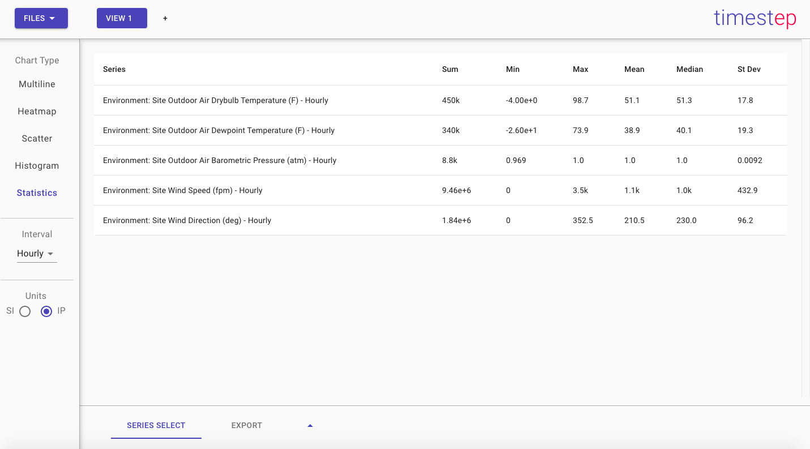

# Timestep

A SQL-based timeseries viewer for [EnergyPlus](https://energyplus.net/) output.
Timestep is a cross-platform desktop app (Electron + React) that loads
EnergyPlus simulation results and lets you explore the timeseries interactively
— line charts, heatmaps, histograms, scatter plots, and summary statistics —
without writing any SQL.



## What it does

- **Loads `.sql` and `.eso` output directly.** Point it at an EnergyPlus
  `eplusout.sql` (from `Output:SQLite`) or a raw `eplusout.eso`. ESO files are
  converted to SQLite on the fly and cached, so models without `Output:SQLite`
  work too — conversion is verified row-identical to native `.sql` at every
  reporting frequency.
- **Multiple simulations side by side.** Load several output files and compare
  the same variable across runs on one chart.
- **Searchable variables.** Filter the report-variable dictionary by name to
  find a series quickly.
- **Unit conversion.** Picks up IP/SI conversions (e.g. m³/s → cfm/gpm) from a
  sibling `.bnd` file when present.
- **Export.** Copy series to the clipboard, save to CSV, and save/restore a
  full viewing session (`.tss`).

| | |
|---|---|
|  |  |
|  |  |

## Install

Download the installer for your platform from the
[Releases](https://github.com/michaelsweeney/timestep/releases) page:

- **macOS** — `.dmg`
- **Windows** — `.exe` (NSIS) or `.msi`
- **Linux** — `.AppImage`, `.deb`, or `.rpm`

## Run in a browser (no install)

The same UI also builds as a static web app — no Electron, no installer. It
runs SQLite in the tab via [sql.js](https://sql.js.org/) (WebAssembly), so you
drop an `.sql` or `.eso` straight onto the page and chart it:

```bash
yarn build-web    # bundles to app/dist-web/ (web.js + style.css + sql-wasm)
yarn start-web    # serve app/dist-web on http://localhost:8080
```

It's the desktop renderer byte-for-byte; the only difference is the I/O layer
(`app/src/web/`) — a browser `window.api` shim backed by the File API, Blob
downloads, and the in-tab sql.js engine instead of the Electron preload bridge.

Browser-specific limits, both inherent to the sandbox: cfm/gpm unit resolution
needs the sibling `.bnd` dropped alongside the `.sql`/`.eso` (a browser can't
read sibling files by path; without it units fall back to cfm), and very large
annual outputs load entirely into tab memory, so the desktop app remains the
better choice for multi-gigabyte runs.

## Development

Requires Node.js 18+ (CI runs on Node 24) and Yarn 1.x.

```bash
yarn install                      # root deps
yarn --cwd packages/core install  # @timestep/core (linked workspace)
yarn dev                          # renderer dev server + Electron with reload
```

Common scripts:

```bash
yarn build                    # build main + renderer bundles
yarn build-web                # build the standalone browser app (app/dist-web)
yarn --cwd packages/core test # core parsing/query unit tests (vitest)
yarn smoke-ui                 # end-to-end UI smoke test against the built app
yarn smoke-web                # same, but drives the web build in headless Chromium
yarn package-linux            # build installers for the current platform
```

`yarn smoke-ui`, `yarn smoke-web`, and `yarn eplus-matrix` need local EnergyPlus
fixtures; see `scripts/eplus-matrix.mjs` and `test-models/README` for
regenerating them. `yarn smoke-web` also needs a system Chromium/Chrome.

## Architecture

- **`app/`** — the Electron app. The renderer runs with `nodeIntegration: false`
  and `contextIsolation: true`; all filesystem and database access goes through
  a narrow preload bridge (`app/preload.js` + `app/ipc-handlers.ts`).
- **`packages/core`** (`@timestep/core`) — environment-neutral parsing and query
  logic (ESO→SQLite conversion, `.bnd` parsing, series queries), extracted as a
  tested, reusable library. The query layer talks to an injected `Engine`
  interface, so the same code runs against native `sqlite3` in Electron's main
  process and against sql.js (WebAssembly) in the browser build.
- **`app/src/web/`** — the browser I/O layer: a `window.api` shim and the
  sql.js-backed engine that together replace the Electron preload bridge, letting
  the unchanged renderer run as a static site (`yarn build-web`).

See [`MODERNIZATION_PROGRESS.md`](MODERNIZATION_PROGRESS.md) for the v2.0.0
modernization history and remaining follow-ups.

## License

MIT © 2020–present Michael Sweeney
